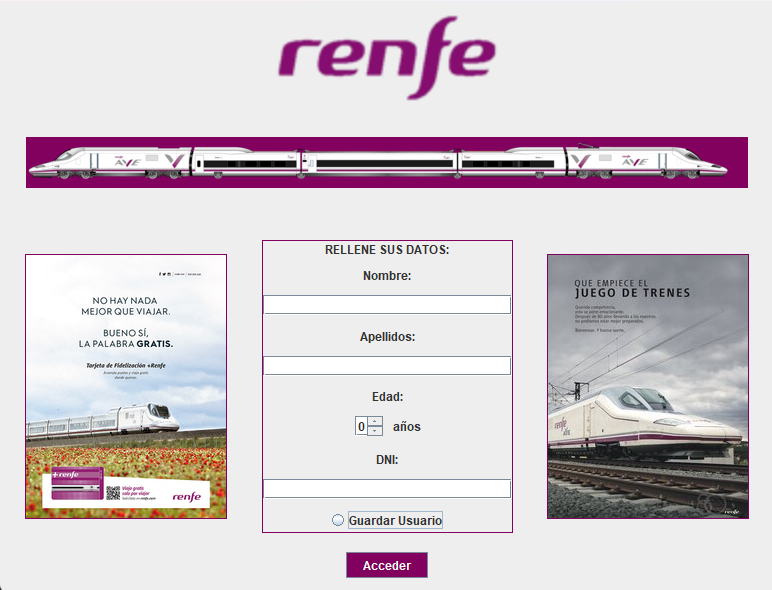
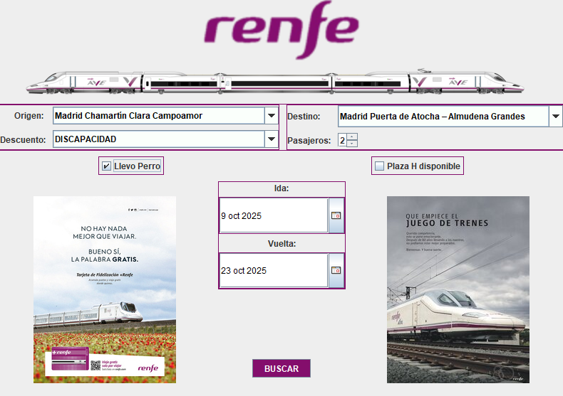

# RecargaTrasportes

#Interfaz 1:



#Interfaz 2:



#Interfaz 3:


# Sistema de Compra de Billetes RENFE

Una aplicación de escritorio desarrollada en Java Swing que simula el sistema completo de compra de billetes de tren de RENFE (Red Nacional de los Ferrocarriles Españoles). El proyecto incluye un sistema de autenticación de usuarios y una interfaz completa de compra con generación de billetes digitales profesionales.

## 📋 Descripción del Proyecto

Este sistema implementa una solución integral para la gestión y compra de billetes de tren con dos interfaces principales:

1. **Interfaz de Login (RenfeInterfaz)**: Pantalla de registro/autenticación donde el usuario introduce sus datos personales
2. **Interfaz de Compra (comprabilletes)**: Sistema completo de búsqueda, selección y compra de billetes con generación de documentos digitales

El proyecto hace uso extensivo de componentes Swing y la librería JCalendar para proporcionar una experiencia de usuario fluida y profesional, siguiendo los criterios de usabilidad y diseño de interfaces gráficas.

## ✨ Características Principales

### 🔐 Sistema de Autenticación (RenfeInterfaz.java)

La primera interfaz presenta un formulario de registro con las siguientes características:

#### Componentes Visuales:
- **Header con branding**: Logo de RENFE y representación gráfica del tren AVE
- **Formulario centrado** con los siguientes campos:
  - `textfieldnombre`: Campo de texto para el nombre
  - `textfieldapellido`: Campo de texto para los apellidos
  - `textField3`: Campo de texto para el DNI
  - `spinner1`: Selector numérico para la edad (JSpinner)
  - `comboBox1`: Selector desplegable (posiblemente para tipo de documento)
  - `accederButton`: Botón de acceso al sistema

#### Validaciones Implementadas:
```java
// Validación de campos vacíos
if (nombre.isEmpty() || apellido.isEmpty() || dni.isEmpty()) {
    JOptionPane.showMessageDialog(null, "Por favor, rellena todos los campos");
    return;
}

// Validación de edad mínima (mayoría de edad)
if (edad < 18) {
    JOptionPane.showMessageDialog(null, "Debes ser mayor de edad");
}

// Validación de edad máxima (rango razonable)
else if (edad >= 200) {
    JOptionPane.showMessageDialog(null, "Edad no válida");
}
```

#### Flujo de Navegación:
1. El usuario completa todos los campos obligatorios
2. El sistema valida la información introducida
3. Si es válida, cierra la ventana de login: `SwingUtilities.getWindowAncestor(accederButton).dispose()`
4. Abre la ventana de compra pasando los datos del usuario como parámetros al constructor

### 🎫 Sistema de Compra de Billetes (comprabilletes.java)

La segunda interfaz es mucho más compleja e implementa toda la lógica de negocio para la compra de billetes.

#### Estructura de Datos del Usuario:
```java
private String nombreUsuario;    // Almacena el nombre del pasajero
private String apellidoUsuario;  // Almacena los apellidos
private String dniUsuario;       // Documento de identidad
private int edadUsuario;         // Edad para aplicar descuentos
```

Estos datos se reciben en el constructor y se utilizan posteriormente para personalizar el billete generado.

#### Componentes de la Interfaz:

**Panel de Navegación (`panelNav`)**:
- Área superior con opciones de navegación y menú principal

**Selectores de Ruta**:
- `comboBox1`: Selección de estación de origen (ej: Madrid Chamartín Clara Campoamor)
- `comboBox2`: Selección de estación de destino (ej: Madrid Puerta de Atocha – Almudena Grandes)
- `comboBox3`: Tipo de tarifa/descuento:
  - Tarifa normal
  - JOVEN (25% descuento)
  - SENIOR (20% descuento)
  - DISCAPACIDAD

**Selector de Pasajeros**:
- `spinner1`: JSpinner para seleccionar el número de viajeros (1-10 típicamente)

**Selectores de Fecha**:
```java
// Panel de fecha de ida
panelIda.setLayout(new BorderLayout());
JDateChooser dateChooser = new JDateChooser();
panelIda.add(dateChooser, BorderLayout.CENTER);

// Panel de fecha de vuelta
panelVuelta.setLayout(new BorderLayout());
JDateChooser dateChooser2 = new JDateChooser();
panelVuelta.add(dateChooser2, BorderLayout.CENTER);
```
Utiliza **JDateChooser** de la librería JCalendar para proporcionar un calendario visual interactivo.

**Opciones Especiales**:
- `llevoPerroCheckBox`: Checkbox para indicar viaje con mascota (+10€)
- `plazaHDisponibleCheckBox`: Checkbox para solicitar plaza adaptada (asiento tipo H)

**Botón de Búsqueda**:
- `BUSCARButton`: Desencadena el proceso de generación del billete

### 🎨 Generación del Billete Digital

El método `mostrarBillete()` es el núcleo del sistema. Genera un diálogo modal con el billete completo:

#### Proceso de Generación:

**1. Recopilación de Datos:**
```java
String estacionSalida = comboBox1.getSelectedItem().toString();
String estacionLlegada = comboBox2.getSelectedItem().toString();
int pasajeros = (Integer) spinner1.getValue();
String descuentoTexto = comboBox3.getSelectedItem().toString();
boolean descuentoH = plazaHDisponibleCheckBox.isSelected();
boolean perro = llevoPerroCheckBox.isSelected();

// Formato de fechas
SimpleDateFormat sdf = new SimpleDateFormat("dd/MM/yyyy");
String fechaIda = ida.getDate() != null ? sdf.format(ida.getDate()) : "No seleccionada";
String fechaVuelta = vuelta.getDate() != null ? sdf.format(vuelta.getDate()) : "No seleccionada";
```

**2. Creación del Diálogo:**
```java
JDialog dialog = new JDialog((Frame)null, "Billete RENFE", true);
dialog.setSize(700, 450);  // Tamaño óptimo para visualización
dialog.setLocationRelativeTo(null);  // Centrado en pantalla
```

**3. Estructura del Billete:**

El billete se compone de tres secciones principales:

##### **Panel Superior (Header)**:
```java
JPanel topPanel = new JPanel(new BorderLayout());

// Logo RENFE con estilo corporativo
JLabel logoLabel = new JLabel("renfe", SwingConstants.RIGHT);
logoLabel.setFont(new Font("Arial", Font.BOLD | Font.ITALIC, 36));
logoLabel.setForeground(new Color(102, 45, 145));  // Color púrpura corporativo

// Información del billete
JLabel lblNumBillete = new JLabel("Num. Billete: " + generarNumeroBillete());
JLabel lblLocalizador = new JLabel("Localizador: " + generarLocalizador());
JLabel lblTarifa = new JLabel("Tarifa: " + descuentoTexto);
```

##### **Panel Central (Detalles del Viaje)**:
```java
JPanel centerPanel = new JPanel(new GridLayout(0, 4, 15, 8));
// Grid de 4 columnas con espaciado horizontal y vertical

// Primera fila: Información del trayecto
addBilleteField(centerPanel, "Salida", estacionSalida.toUpperCase());
addBilleteField(centerPanel, "Llegada", estacionLlegada.toUpperCase());
addBilleteField(centerPanel, "Fecha", fechaIda);
addBilleteField(centerPanel, "Hora", "08:30");

// Segunda fila: Información del tren
addBilleteField(centerPanel, "AVE", generarNumeroTren());
addBilleteField(centerPanel, "Tipo", "Turista");
addBilleteField(centerPanel, "Coche", String.valueOf(new Random().nextInt(10) + 1));
addBilleteField(centerPanel, "Plaza", generarAsiento(descuentoH));

// Tercera fila: Datos del pasajero
String nombreCompleto = nombreUsuario + " " + apellidoUsuario;
addBilleteField(centerPanel, "Pasajero", nombreCompleto.toUpperCase());
addBilleteField(centerPanel, "DNI", dniUsuario);
addBilleteField(centerPanel, "Edad", String.valueOf(edadUsuario) + " años");
```

El método auxiliar `addBilleteField()` crea cada campo del billete:
```java
private void addBilleteField(JPanel panel, String label, String value) {
    JPanel fieldPanel = new JPanel();
    fieldPanel.setLayout(new BoxLayout(fieldPanel, BoxLayout.Y_AXIS));
    
    // Etiqueta del campo (ej: "Salida")
    JLabel lblLabel = new JLabel(label);
    lblLabel.setFont(new Font("Arial", Font.BOLD, 11));
    
    // Valor del campo (ej: "MADRID CHAMARTÍN")
    JLabel lblValue = new JLabel(value);
    lblValue.setFont(new Font("Arial", Font.PLAIN, 13));
    
    fieldPanel.add(lblLabel);
    fieldPanel.add(lblValue);
    panel.add(fieldPanel);
}
```

##### **Panel Inferior (Precio e Información Adicional)**:
```java
// Cálculo y visualización del precio
double precio = calcularPrecio(pasajeros, descuentoTexto, perro);
JLabel lblTotal = new JLabel("Total: " + String.format("%.2f", precio) + " €");
lblTotal.setFont(new Font("Arial", Font.BOLD, 16));

JLabel lblGastos = new JLabel("Gastos de gestión: 0.00 €");

// Información adicional según opciones seleccionadas
if (pasajeros > 1) {
    JLabel lblPasajeros = new JLabel("• Pasajeros: " + pasajeros);
}
if (perro) {
    JLabel lblPerro = new JLabel("• Viaja con mascota");
}
```

### 🔢 Funciones Generadoras

#### Número de Billete:
```java
private String generarNumeroBillete() {
    Random rand = new Random();
    // Genera un número de 13 dígitos único
    return String.format("%013d", rand.nextLong() % 10000000000000L);
}
```
Ejemplo: `4764109545576`

#### Localizador:
```java
private String generarLocalizador() {
    String chars = "ABCDEFGHIJKLMNOPQRSTUVWXYZ0123456789";
    Random rand = new Random();
    StringBuilder sb = new StringBuilder(6);
    for (int i = 0; i < 6; i++) {
        sb.append(chars.charAt(rand.nextInt(chars.length())));
    }
    return sb.toString();
}
```
Ejemplo: `T4J2R1`

#### Número de Tren:
```java
private String generarNumeroTren() {
    // Formato de 5 dígitos para número AVE
    return String.format("%05d", new Random().nextInt(10000));
}
```
Ejemplo: `06380`

#### Asiento:
```java
private String generarAsiento(boolean descuentoH) {
    Random rand = new Random();
    int numero = rand.nextInt(80) + 1;  // Asientos del 1 al 80
    
    // Si tiene plaza adaptada, asigna asiento tipo H
    String letra = descuentoH ? "H" : String.valueOf((char)('A' + rand.nextInt(4)));
    return numero + letra;
}
```
Ejemplos: `75A`, `23B`, `45H` (adaptado)

### 💰 Sistema de Cálculo de Precios

```java
private double calcularPrecio(int pasajeros, String descuento, boolean perro) {
    double precioBase = 38.20;  // Precio base por pasajero
    double total = precioBase * pasajeros;
    
    // Aplicación de descuentos según tarifa
    if (descuento.contains("JOVEN")) {
        total *= 0.75;  // 25% de descuento
    } else if (descuento.contains("SENIOR")) {
        total *= 0.80;  // 20% de descuento
    }
    // DISCAPACIDAD no tiene descuento adicional en esta implementación
    
    // Suplemento por mascota
    if (perro) {
        total += 10.0;
    }
    
    return total;
}
```

**Ejemplos de precios:**
- 1 pasajero, tarifa normal: 38,20€
- 2 pasajeros, tarifa JOVEN: (38,20 × 2) × 0.75 = 57,30€
- 1 pasajero SENIOR con mascota: (38,20 × 0.80) + 10 = 40,56€

## 🛠️ Tecnologías y Componentes Utilizados

### Librerías Principales:
- **Java SE 8+**: Plataforma base del desarrollo
- **javax.swing**: Framework completo para GUI
  - `JFrame`: Ventanas principales
  - `JPanel`: Contenedores de componentes
  - `JLabel`: Etiquetas de texto
  - `JTextField`: Campos de entrada de texto
  - `JButton`: Botones interactivos
  - `JComboBox`: Listas desplegables
  - `JSpinner`: Selectores numéricos
  - `JCheckBox`: Casillas de verificación
  - `JDialog`: Ventanas modales
  - `JOptionPane`: Cuadros de diálogo de alerta

- **com.toedter.calendar.JDateChooser**: Selector de fechas con calendario visual
- **java.awt**: Gestión de layouts y eventos
  - `BorderLayout`: Layout de 5 zonas (North, South, East, West, Center)
  - `GridLayout`: Layout de cuadrícula
  - `BoxLayout`: Layout vertical/horizontal flexible
  - `Color`, `Font`: Personalización visual

### Patrones de Diseño Utilizados:

**1. Patrón de Eventos (Event-Driven)**:
```java
BUSCARButton.addActionListener(new ActionListener() {
    @Override
    public void actionPerformed(ActionEvent e) {
        mostrarBillete(dateChooser, dateChooser2);
    }
});
```

**2. Patrón de Inyección de Dependencias**:
```java
public comprabilletes(String nombre, String apellido, String dni, int edad) {
    this.nombreUsuario = nombre;
    this.apellidoUsuario = apellido;
    this.dniUsuario = dni;
    this.edadUsuario = edad;
    // Inicialización de componentes...
}
```

**3. Patrón de Composición de UI**:
```java
// Composición de paneles para estructura jerárquica
billetePanel.add(topPanel, BorderLayout.NORTH);
billetePanel.add(centerPanel, BorderLayout.CENTER);
billetePanel.add(bottomContainer, BorderLayout.SOUTH);
```

## 📦 Estructura del Proyecto

```
RENFE-Sistema/
│
├── src/
│   └── Interfaz/
│       ├── RenfeInterfaz.java          # Interfaz principal de login
│       └── comprabilletes.java         # Interfaz de compra y generación
│
├── lib/
│   └── jcalendar-x.x.x.jar            # Librería JCalendar
│
├── resources/
│   └── images/                         # Imágenes del proyecto (logos, etc.)
│
└── README.md                           # Este archivo
```

## 🚀 Instalación y Ejecución

### Requisitos Previos:
- **Java Development Kit (JDK)** 8 o superior
- **JCalendar Library** (com.toedter.calendar)
- IDE recomendado: IntelliJ IDEA, Eclipse o NetBeans

### Paso 1: Instalación de JCalendar

#### Opción A: Descarga Manual
1. Visitar [toedter.com/jcalendar](https://toedter.com/jcalendar/)
2. Descargar el archivo JAR (`jcalendar-x.x.x.jar`)
3. Colocar en la carpeta `lib/` del proyecto

#### Opción B: Maven (si usas Maven)
```xml
<dependency>
    <groupId>com.toedter</groupId>
    <artifactId>jcalendar</artifactId>
    <version>1.4</version>
</dependency>
```

### Paso 2: Configuración del Proyecto

#### En IntelliJ IDEA:
1. **File → Project Structure → Libraries**
2. Click en **+** y seleccionar **Java**
3. Navegar hasta `jcalendar-x.x.x.jar` y añadirlo
4. Click en **Apply** y **OK**

#### En Eclipse:
1. Click derecho en el proyecto → **Properties**
2. **Java Build Path → Libraries**
3. Click en **Add External JARs**
4. Seleccionar `jcalendar-x.x.x.jar`
5. Click en **Apply and Close**

#### En NetBeans:
1. Click derecho en **Libraries** en el árbol del proyecto
2. Seleccionar **Add JAR/Folder**
3. Navegar hasta `jcalendar-x.x.x.jar`
4. Click en **Open**

### Paso 3: Compilación

#### Usando IDE:
Simplemente ejecutar `RenfeInterfaz.java` desde el IDE (botón Run/Play)

#### Línea de Comandos:
```bash
# Compilar
javac -cp .:lib/jcalendar-x.x.x.jar Interfaz/*.java

# En Windows usar ; en lugar de :
javac -cp .;lib/jcalendar-x.x.x.jar Interfaz/*.java

# Ejecutar
java -cp .:lib/jcalendar-x.x.x.jar Interfaz.RenfeInterfaz

# En Windows
java -cp .;lib/jcalendar-x.x.x.jar Interfaz.RenfeInterfaz
```

### Paso 4: Verificación
Si todo está correcto, debería aparecer la ventana de login de RENFE.

## 💡 Guía de Uso Completo

### Escenario 1: Compra Simple

1. **Iniciar la aplicación**
   - Ejecutar `RenfeInterfaz.java`
   
2. **Completar el formulario de registro**
   ```
   Nombre: Pablo
   Apellidos: Belascoain
   DNI: 32784132K
   Edad: 22
   ```

3. **Click en "Acceder"**
   - El sistema valida los datos
   - Se cierra la ventana de login
   - Se abre la ventana de compra

4. **Seleccionar el viaje**
   ```
   Origen: Madrid Chamartín Clara Campoamor
   Destino: Madrid Puerta de Atocha – Almudena Grandes
   Descuento: DISCAPACIDAD
   Pasajeros: 2
   ```

5. **Seleccionar fechas**
   - Ida: 9 oct 2025
   - Vuelta: 23 oct 2025

6. **Opciones especiales**
   - ☑ Llevo Perro
   - ☐ Plaza H disponible

7. **Click en "BUSCAR"**
   - Aparece el billete digital generado
   - Total calculado: 86,40€ (2 pasajeros + mascota)

### Escenario 2: Viaje con Descuento JOVEN

1. **Datos del usuario**
   ```
   Nombre: Ana
   Apellidos: García López
   DNI: 45678901B
   Edad: 20
   ```

2. **Datos del viaje**
   ```
   Origen: Barcelona Sants
   Destino: Madrid Atocha
   Descuento: JOVEN (25%)
   Pasajeros: 1
   Ida: 15 nov 2025
   Vuelta: 20 nov 2025
   ```

3. **Resultado**
   - Precio base: 38,20€
   - Descuento JOVEN: -9,55€ (25%)
   - **Total: 28,65€**

### Escenario 3: Grupo Familiar con SENIOR

1. **Datos del usuario**
   ```
   Nombre: Carmen
   Apellidos: Rodríguez Pérez
   DNI: 12345678A
   Edad: 68
   ```

2. **Datos del viaje**
   ```
   Origen: Sevilla Santa Justa
   Destino: Valencia Joaquín Sorolla
   Descuento: SENIOR (20%)
   Pasajeros: 3
   Plaza H disponible: ☑
   ```

3. **Resultado**
   - Precio base: 38,20€ × 3 = 114,60€
   - Descuento SENIOR: -22,92€ (20%)
   - Plaza adaptada asignada: Ejemplo "45H"
   - **Total: 91,68€**

## 🎯 Características Técnicas Avanzadas

### Sistema de Layouts Anidados

El proyecto utiliza una estrategia de layouts anidados para lograr una interfaz profesional:

```java
// Layout principal del billete
JPanel billetePanel = new JPanel();
billetePanel.setLayout(new BorderLayout(10, 10));

// Panel superior con BorderLayout
JPanel topPanel = new JPanel(new BorderLayout());
topPanel.add(logoLabel, BorderLayout.EAST);
topPanel.add(infoPanel, BorderLayout.WEST);

// Panel central con GridLayout de 4 columnas
JPanel centerPanel = new JPanel(new GridLayout(0, 4, 15, 8));

// Cada campo con BoxLayout vertical
JPanel fieldPanel = new JPanel();
fieldPanel.setLayout(new BoxLayout(fieldPanel, BoxLayout.Y_AXIS));
```

Esta estructura permite:
- **Flexibilidad**: Adaptación automática al contenido
- **Organización**: Separación clara de secciones
- **Mantenibilidad**: Fácil modificación de componentes individuales

### Gestión de Fechas con JDateChooser

```java
// Inicialización del calendario
JDateChooser dateChooser = new JDateChooser();
dateChooser.setDateFormatString("dd/MM/yyyy");
dateChooser.setMinSelectableDate(new Date()); // Solo fechas futuras

// Validación de fecha seleccionada
if (ida.getDate() != null) {
    SimpleDateFormat sdf = new SimpleDateFormat("dd/MM/yyyy");
    String fechaIda = sdf.format(ida.getDate());
} else {
    String fechaIda = "No seleccionada";
}
```

### Validación de Datos Multinivel

El sistema implementa validaciones en diferentes capas:

1. **Validación de UI**: Antes de procesar
   ```java
   if (nombre.isEmpty() || apellido.isEmpty() || dni.isEmpty()) {
       JOptionPane.showMessageDialog(null, "Por favor, rellena todos los campos");
       return;
   }
   ```

2. **Validación de Negocio**: Reglas de la aplicación
   ```java
   if (edad < 18) {
       JOptionPane.showMessageDialog(null, "Debes ser mayor de edad");
       return;
   }
   ```

3. **Validación de Formato**: Datos correctos
   ```java
   if (edad >= 200) {
       JOptionPane.showMessageDialog(null, "Edad no válida");
       return;
   }
   ```

### Personalización Visual con Bordes y Márgenes

```java
// Borde compuesto: línea + padding interno
billetePanel.setBorder(BorderFactory.createCompoundBorder(
    BorderFactory.createLineBorder(new Color(100, 100, 100), 2),  // Borde gris de 2px
    new EmptyBorder(20, 20, 20, 20)  // Margen interno de 20px
));

// Espacio vertical entre componentes
bottomPanel.add(Box.createVerticalStrut(10));
```

### Generación Aleatoria con Formato

```java
// Uso de String.format para mantener formato consistente
String numBillete = String.format("%013d", valor);     // 13 dígitos con ceros a la izquierda
String numTren = String.format("%05d", valor);         // 5 dígitos con ceros a la izquierda
String precio = String.format("%.2f", valor);          // 2 decimales para moneda
```

## 📊 Diagrama de Flujo de la Aplicación

```
┌─────────────────────────────────────────────────┐
│         INICIO DE APLICACIÓN                    │
│         (RenfeInterfaz.main())                  │
└─────────────────┬───────────────────────────────┘
                  │
                  ▼
┌─────────────────────────────────────────────────┐
│      VENTANA DE LOGIN                           │
│  ┌───────────────────────────────────────────┐  │
│  │  • Nombre                                 │  │
│  │  • Apellidos                              │  │
│  │  • DNI                                    │  │
│  │  • Edad (Spinner)                         │  │
│  │  [Botón: Acceder]                         │  │
│  └───────────────────────────────────────────┘  │
└─────────────────┬───────────────────────────────┘
                  │
                  ▼
          ┌───────────────┐
          │  VALIDACIÓN   │
          │  ¿Datos OK?   │
          └───┬───────┬───┘
              │ NO    │ SÍ
              │       │
              ▼       ▼
        [Mensaje] [Cerrar Login]
         de Error     │
              │       ▼
              │  ┌─────────────────────────────────────┐
              │  │  VENTANA DE COMPRA                  │
              │  │  (comprabilletes)                   │
              │  │  Constructor recibe datos usuario    │
              │  └─────────────┬───────────────────────┘
              │                │
              └────────────────┘
                               ▼
              ┌────────────────────────────────────────┐
              │  FORMULARIO DE BÚSQUEDA                │
              │  ┌──────────────────────────────────┐  │
              │  │  • Origen (ComboBox)             │  │
              │  │  • Destino (ComboBox)            │  │
              │  │  • Fecha Ida (JDateChooser)      │  │
              │  │  • Fecha Vuelta (JDateChooser)   │  │
              │  │  • Nº Pasajeros (Spinner)        │  │
              │  │  • Descuento (ComboBox)          │  │
              │  │  • ☐ Llevo Perro                 │  │
              │  │  • ☐ Plaza H disponible          │  │
              │  │  [Botón: BUSCAR]                 │  │
              │  └──────────────────────────────────┘  │
              └────────────────┬───────────────────────┘
                               │
                               ▼
              ┌────────────────────────────────────────┐
              │  mostrarBillete()                      │
              │  • Recopilar datos formulario          │
              │  • Generar número billete              │
              │  • Generar localizador                 │
              │  • Generar número tren                 │
              │  • Generar asiento                     │
              │  • Calcular precio                     │
              └────────────────┬───────────────────────┘
                               │
                               ▼
              ┌────────────────────────────────────────┐
              │  DIÁLOGO MODAL CON BILLETE             │
              │  ┌──────────────────────────────────┐  │
              │  │  [LOGO RENFE]                    │  │
              │  │  Num. Billete: 4764109545576     │  │
              │  │  Localizador: T4J2R1             │  │
              │  │  Tarifa: DISCAPACIDAD            │  │
              │  │  ────────────────────────────    │  │
              │  │  Salida: MADRID CHAMARTÍN        │  │
              │  │  Llegada: MADRID ATOCHA          │  │
              │  │  Fecha: 09/10/2025               │  │
              │  │  Hora: 08:30                     │  │
              │  │  ────────────────────────────    │  │
              │  │  AVE: 06380                      │  │
              │  │  Tipo: Turista                   │  │
              │  │  Coche: 4                        │  │
              │  │  Plaza: 75A                      │  │
              │  │  ────────────────────────────    │  │
              │  │  Pasajero: PABLO BELASCOAIN      │  │
              │  │  DNI: 32784132K                  │  │
              │  │  Edad: 22 años                   │  │
              │  │  ────────────────────────────    │  │
              │  │  Total: 86,40 €                  │  │
              │  │  Gastos de gestión: 0.00 €       │  │
              │  │  • Pasajeros: 2                  │  │
              │  │  • Viaja con mascota             │  │
              │  └──────────────────────────────────┘  │
              └────────────────────────────────────────┘


